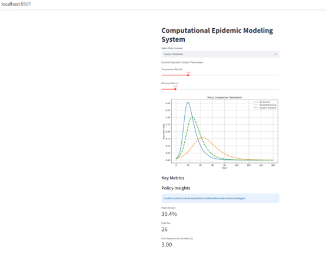
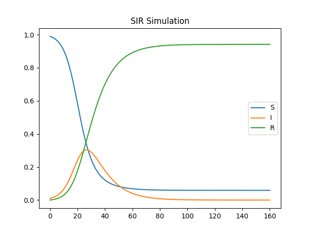
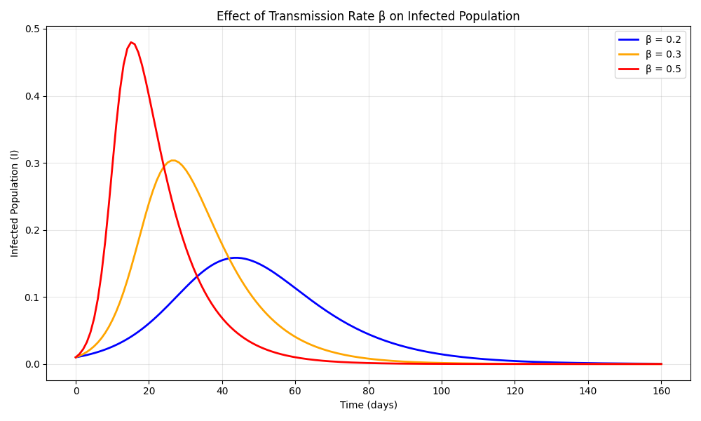
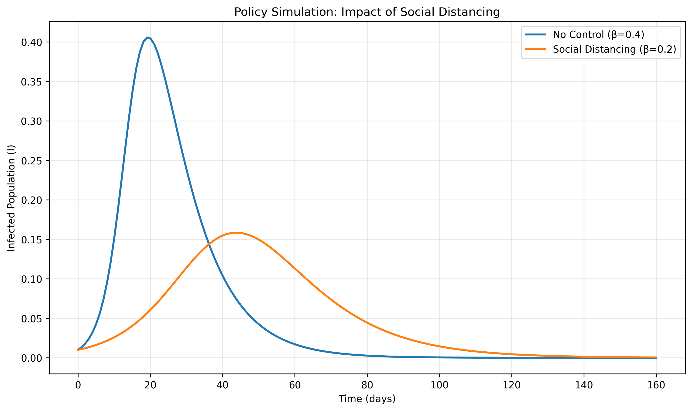

Computational Epidemic Modeling & Decision Support System

An interactive epidemic modeling and decision support system developed using Python, SciPy, Streamlit, and data visualization techniques.

The project simulates infectious disease transmission using the SIR (Susceptible–Infected–Recovered) model and evaluates the impact of different intervention policies through scenario analysis and interactive dashboards.

Project Overview

This project provides:

SIR epidemic simulation

Transmission rate sensitivity analysis

Policy intervention comparison

Peak infection and outbreak timing analysis

Interactive Streamlit dashboard

Decision support for epidemic control strategies

System Dashboard

Interactive dashboard featuring:

Policy Scenario Selector

Transmission Rate (β)

Recovery Rate (γ)

Peak Infection Analysis

Peak Day Analysis

Basic Reproduction Number (R₀)

Policy Comparison Dashboard

SIR Simulation

Baseline epidemic simulation showing the evolution of:

Susceptible Population (S)

Infected Population (I)

Recovered Population (R)

Beta Sensitivity Analysis

Comparison of infection dynamics under different transmission rates (β).

Key findings:

Higher β results in faster disease spread.

Higher β produces larger infection peaks.

Epidemics reach their peak earlier when transmission rates increase.

Policy Simulation

Comparison between:

No Control (β = 0.4)

Social Distancing (β = 0.2)

Key findings:

Social distancing significantly reduces peak infection.

Social distancing delays the outbreak peak.

Intervention policies flatten the epidemic curve.

Example Results

Scenario	            Peak Infection	    Peak Day
No Control	            40.6%	              19
Social Distancing	     15.8%	              44

Technologies Used

Python

NumPy

SciPy

Matplotlib

Streamlit

Run Locally

pip install -r requirements.txt

streamlit run app.py

Future Improvements

SEIR epidemic model

Vaccination strategies

Healthcare capacity constraints

Real-world epidemic datasets

Geographic spread simulation

## System Dashboard

Key Metrics
Policy Insights
Custom scenario allows exploration of alternative intervention strategies.

Peak Infection

30.4%

Peak Day

26

Basic Reproduction Number (R₀)

3.00

## SIR Simulation

## Beta Sensitivity Analysis

## Policy Simulation

Author

Xu Qingfu

engineering

